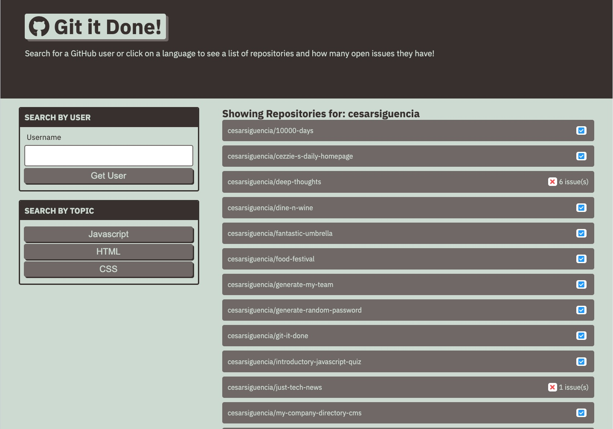
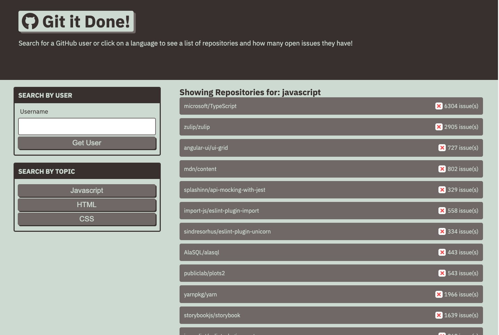

# Git It Done by CS

A simple GitHub repo search engine built using HTML, CSS, and JS with various GitHub APIs, which will allow the user to search for repos by using a GitHub username or see featured repos on GitHub by selecting a front end language. Users can see a search list of available repositories along with quantity of issues they may have. Click on the repo block to expand and view all the issues.

APIs being used
- GitHub repositories search (by front end language, featured, and issues)
- GitHub users search (by GitHub username, followed by populated repositories created by user)
- GitHub single repositories search (populate issues of repository)

### Link
https://cesarsiguencia.github.io/git-it-done/

### Screenshots

